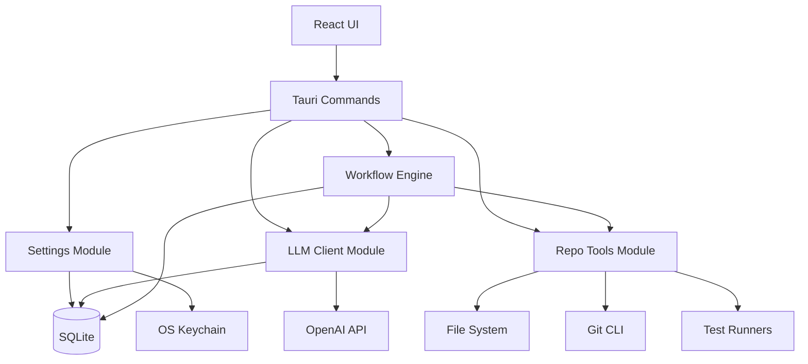

# SpecTrail Implementation Plan

## Executive Summary

This plan details the implementation of SpecTrail's core features: BYOK settings, LLM client with tool calling, repo tools, and the Plan/Verify/Phases workflow modes. The implementation follows a layered approach: database → backend services → frontend integration.

---

## Current State Analysis

### Existing Infrastructure
- **Frontend**: React 18 + TypeScript + Vite + React Router
- **Backend**: Tauri v2 + Rust (stable edition 2021)
- **Database**: SQLite via rusqlite with migration system
- **Existing Tables**: projects, tasks, phases, runs, messages, artifacts
- **Existing Commands**: Full CRUD for projects/tasks/runs/messages/artifacts
- **Routes**: `/projects`, `/projects/:id`, `/projects/:id/tasks/:taskId`, `/projects/:id/tasks/:taskId/runs/:runId`, `/settings`

### Dependencies Present
- `tauri` v2 with dialog plugin
- `rusqlite` 0.31 (bundled)
- `serde` + `serde_json`
- `uuid` v4
- `time` v0.3
- `thiserror`

### Missing Dependencies (to add)
- `reqwest` (async HTTP client for LLM API calls)
- `tokio` (async runtime)
- `ignore` (gitignore-aware file traversal)
- `walkdir` (directory traversal fallback)
- `tauri-plugin-store` or custom keychain solution for secrets
- Optional: `keyring` crate for OS keychain integration

---

## Architecture Overview



---

## Phase 1: Database Schema & Settings Module

### 1.1 Migration 002: Settings Table

**File**: `src-tauri/migrations/002_settings.sql`

```sql
-- BYOK provider settings (non-sensitive)
CREATE TABLE IF NOT EXISTS settings (
    key TEXT PRIMARY KEY,
    value TEXT NOT NULL,
    updated_at TEXT NOT NULL
);

-- Provider configuration (BYOK settings)
INSERT OR REPLACE INTO settings (key, value, updated_at) VALUES
('provider_name', '', datetime('now')),
('base_url', '', datetime('now')),
('model', '', datetime('now')),
('extra_headers', '{}', datetime('now')),
('temperature', '0.7', datetime('now')),
('max_tokens', '4096', datetime('now')),
('dev_mode', 'false', datetime('now'));

-- Update tool_calls table to include status field
ALTER TABLE tool_calls ADD COLUMN status TEXT DEFAULT 'pending';
ALTER TABLE tool_calls ADD COLUMN error TEXT;
```

### 1.2 Settings Model

**File**: `src-tauri/src/models.rs` (additions)

```rust
#[derive(Debug, Serialize, Deserialize, Clone)]
pub struct ProviderSettings {
    pub provider_name: String,
    pub base_url: String,
    pub model: String,
    pub extra_headers: serde_json::Value,
    pub temperature: f64,
    pub max_tokens: i64,
    pub dev_mode: bool,
}

#[derive(Debug, Serialize, Deserialize, Clone)]
pub struct SettingsKV {
    pub key: String,
    pub value: String,
    pub updated_at: String,
}
```

### 1.3 Settings Commands

**File**: `src-tauri/src/commands/settings.rs`

```rust
use tauri::AppHandle;
use crate::db;
use crate::models::*;

#[tauri::command]
pub fn get_provider_settings(app: AppHandle) -> Result<ProviderSettings, String> {
    // Load from settings table, return structured object
}

#[tauri::command]
pub fn save_provider_settings(app: AppHandle, settings: ProviderSettings) -> Result<(), String> {
    // Save to settings table
}

#[tauri::command]
pub fn get_api_key(app: AppHandle) -> Result<Option<String>, String> {
    // Try keychain first, fallback to settings with dev_mode warning
}

#[tauri::command]
pub fn set_api_key(app: AppHandle, api_key: Option<String>) -> Result<(), String> {
    // Save to keychain if available, else settings with dev_mode check
}
```

### 1.4 Secret Storage Strategy

**Approach**: Tiered fallback system

1. **Primary**: OS Keychain via `keyring` crate
   - Service name: `com.spectrail.app`
   - Account: `api_key`
   
2. **Fallback**: Encrypted SQLite (if keychain unavailable)
   - Use a derived key from machine-specific identifier
   - XOR or simple AES encryption (acceptable for local threat model)
   
3. **Dev Mode**: Plaintext with explicit warning
   - Only if `dev_mode=true` in settings
   - Show prominent banner in UI

---

## Phase 2: LLM Client Module

### 2.1 Dependencies (Cargo.toml)

```toml
[dependencies]
reqwest = { version = "0.12", features = ["json", "rustls-tls"] }
tokio = { version = "1", features = ["rt-multi-thread"] }
serde = { version = "1", features = ["derive"] }
serde_json = "1"
backoff = { version = "0.4", features = ["tokio"] }
thiserror = "1"
tracing = "0.1"
```

### 2.2 LLM Module Structure

**Files**:
- `src-tauri/src/llm/mod.rs` - Module exports
- `src-tauri/src/llm/client.rs` - HTTP client with retries
- `src-tauri/src/llm/types.rs` - OpenAI-compatible types
- `src-tauri/src/llm/tools.rs` - Tool definitions and execution

### 2.3 LLM Client

**File**: `src-tauri/src/llm/client.rs`

```rust
use reqwest::{Client, StatusCode};
use serde_json::Value;
use std::time::Duration;
use backoff::{ExponentialBackoff, future::retry};

pub struct LlmClient {
    http: Client,
    base_url: String,
    api_key: String,
    extra_headers: Vec<(String, String)>,
}

impl LlmClient {
    pub fn new(base_url: String, api_key: String, extra_headers: Vec<(String, String)>) -> Self {
        let http = Client::builder()
            .timeout(Duration::from_secs(120))
            .build()
            .expect("Failed to build HTTP client");
        
        Self { http, base_url, api_key, extra_headers }
    }
    
    pub async fn chat_completion(
        &self,
        model: &str,
        messages: Vec<ChatMessage>,
        tools: Option<Vec<ToolDefinition>>,
        temperature: f64,
        max_tokens: i64,
    ) -> Result<ChatCompletionResponse, LlmError> {
        // Implement with exponential backoff retry
        // Log to database via injected callback
    }
}

#[derive(Debug, thiserror::Error)]
pub enum LlmError {
    #[error("HTTP error: {0}")]
    Http(#[from] reqwest::Error),
    #[error("API error: {status} - {message}")]
    Api { status: u16, message: String },
    #[error("Timeout")]
    Timeout,
    #[error("Rate limited")]
    RateLimited,
}
```

### 2.4 OpenAI Types

**File**: `src-tauri/src/llm/types.rs`

```rust
use serde::{Deserialize, Serialize};

#[derive(Debug, Clone, Serialize, Deserialize)]
pub struct ChatMessage {
    pub role: String, // system, user, assistant, tool
    pub content: Option<String>,
    #[serde(skip_serializing_if = "Option::is_none")]
    pub tool_calls: Option<Vec<ToolCall>>,
    #[serde(skip_serializing_if = "Option::is_none")]
    pub tool_call_id: Option<String>,
}

#[derive(Debug, Clone, Serialize, Deserialize)]
pub struct ToolCall {
    pub id: String,
    #[serde(rename = "type")]
    pub call_type: String,
    pub function: ToolFunction,
}

#[derive(Debug, Clone, Serialize, Deserialize)]
pub struct ToolFunction {
    pub name: String,
    pub arguments: String,
}

#[derive(Debug, Clone, Serialize, Deserialize)]
pub struct ToolDefinition {
    #[serde(rename = "type")]
    pub def_type: String,
    pub function: FunctionDefinition,
}

#[derive(Debug, Clone, Serialize, Deserialize)]
pub struct FunctionDefinition {
    pub name: String,
    pub description: String,
    pub parameters: serde_json::Value,
}

#[derive(Debug, Clone, Deserialize)]
pub struct ChatCompletionResponse {
    pub id: String,
    pub model: String,
    pub choices: Vec<Choice>,
    pub usage: Option<Usage>,
}

#[derive(Debug, Clone, Deserialize)]
pub struct Choice {
    pub index: i64,
    pub message: ChatMessage,
    pub finish_reason: String,
}

#[derive(Debug, Clone, Deserialize)]
pub struct Usage {
    pub prompt_tokens: i64,
    pub completion_tokens: i64,
    pub total_tokens: i64,
}
```

### 2.5 Tool System

**File**: `src-tauri/src/llm/tools.rs`

```rust
use serde_json::Value;
use crate::repo_tools::RepoTools;

pub struct ToolExecutor {
    repo_tools: RepoTools,
}

impl ToolExecutor {
    pub fn new(repo_path: String) -> Self {
        Self { repo_tools: RepoTools::new(repo_path) }
    }
    
    pub fn get_tool_definitions(&self) -> Vec<ToolDefinition> {
        vec![
            list_files_tool(),
            read_file_tool(),
            grep_tool(),
            git_status_tool(),
            git_diff_tool(),
            git_log_tool(),
            run_command_tool(),
        ]
    }
    
    pub async fn execute(&self, name: &str, args: Value) -> Result<Value, ToolError> {
        match name {
            "list_files" => self.repo_tools.list_files(args).await,
            "read_file" => self.repo_tools.read_file(args).await,
            "grep" => self.repo_tools.grep(args).await,
            "git_status" => self.repo_tools.git_status().await,
            "git_diff" => self.repo_tools.git_diff(args).await,
            "git_log_short" => self.repo_tools.git_log(args).await,
            "run_command" => self.repo_tools.run_command(args).await,
            _ => Err(ToolError::UnknownTool(name.to_string())),
        }
    }
}

#[derive(Debug, thiserror::Error)]
pub enum ToolError {
    #[error("Unknown tool: {0}")]
    UnknownTool(String),
    #[error("Invalid arguments: {0}")]
    InvalidArgs(String),
    #[error("Execution failed: {0}")]
    Execution(String),
    #[error("Path traversal attempt blocked")]
    PathTraversal,
    #[error("Command not in allowlist")]
    DisallowedCommand,
}
```

---

## Phase 3: Repo Tools Module

### 3.1 Module Structure

**Files**:
- `src-tauri/src/repo_tools/mod.rs` - Module exports
- `src-tauri/src/repo_tools/fs.rs` - File system operations
- `src-tauri/src/repo_tools/git.rs` - Git operations
- `src-tauri/src/repo_tools/runner.rs` - Test/lint command runner

### 3.2 Safety Architecture

**Path Traversal Protection**:
```rust
pub fn sanitize_path(base: &Path, requested: &str) -> Result<PathBuf, ToolError> {
    let cleaned = Path::new(requested).components()
        .filter(|c| !matches!(c, Component::ParentDir))
        .collect::<PathBuf>();
    
    let full = base.join(cleaned);
    let canonical = full.canonicalize()
        .map_err(|_| ToolError::PathTraversal)?;
    
    let canonical_base = base.canonicalize()
        .map_err(|_| ToolError::PathTraversal)?;
    
    if !canonical.starts_with(&canonical_base) {
        return Err(ToolError::PathTraversal);
    }
    
    Ok(canonical)
}
```

**Command Allowlist**:
```rust
static ALLOWED_COMMANDS: &[&str] = &[
    "npm test",
    "pnpm test",
    "yarn test",
    "cargo test",
    "pytest",
    "python -m pytest",
    "npm run lint",
    "pnpm lint",
    "cargo clippy",
    "cargo build",
    "npm run build",
    "pnpm build",
];
```

### 3.3 Tool Implementations

**File**: `src-tauri/src/repo_tools/fs.rs`

```rust
use ignore::WalkBuilder;
use walkdir::DirEntry;

const IGNORE_PATTERNS: &[&str] = &[
    "node_modules",
    ".git",
    "target",
    "dist",
    "build",
    ".next",
    "*.log",
];

impl RepoTools {
    pub async fn list_files(&self, args: Value) -> Result<Value, ToolError> {
        let recursive = args.get("recursive").and_then(|v| v.as_bool()).unwrap_or(true);
        let max_files = args.get("max_files").and_then(|v| v.as_u64()).unwrap_or(1000) as usize;
        
        let mut files = vec![];
        let walker = WalkBuilder::new(&self.repo_path)
            .hidden(false)
            .git_ignore(true)
            .build();
        
        for entry in walker {
            let entry = entry.map_err(|e| ToolError::Execution(e.to_string()))?;
            // ... collect files
        }
        
        Ok(json!({ "files": files, "truncated": files.len() >= max_files }))
    }
    
    pub async fn read_file(&self, args: Value) -> Result<Value, ToolError> {
        let path = args.get("path").and_then(|v| v.as_str())
            .ok_or_else(|| ToolError::InvalidArgs("path required".to_string()))?;
        
        let max_size = args.get("max_size").and_then(|v| v.as_u64()).unwrap_or(50_000);
        
        let full_path = sanitize_path(&self.repo_path, path)?;
        
        let metadata = tokio::fs::metadata(&full_path).await
            .map_err(|e| ToolError::Execution(e.to_string()))?;
        
        if metadata.len() > max_size {
            let content = tokio::fs::read_to_string(&full_path).await
                .map_err(|e| ToolError::Execution(e.to_string()))?;
            let truncated = &content[..max_size as usize];
            return Ok(json!({
                "content": truncated,
                "truncated": true,
                "total_size": metadata.len(),
            }));
        }
        
        let content = tokio::fs::read_to_string(&full_path).await
            .map_err(|e| ToolError::Execution(e.to_string()))?;
        
        Ok(json!({ "content": content, "truncated": false }))
    }
    
    pub async fn grep(&self, args: Value) -> Result<Value, ToolError> {
        let pattern = args.get("pattern").and_then(|v| v.as_str())
            .ok_or_else(|| ToolError::InvalidArgs("pattern required".to_string()))?;
        
        let max_results = args.get("max_results").and_then(|v| v.as_u64()).unwrap_or(50);
        
        // Try ripgrep first, fallback to Rust search
        if let Ok(output) = tokio::process::Command::new("rg")
            .args(["-n", "--max-count", &max_results.to_string(), pattern, "."])
            .current_dir(&self.repo_path)
            .output().await
        {
            if output.status.success() {
                let results = String::from_utf8_lossy(&output.stdout);
                return Ok(json!({ "results": results.lines().collect::<Vec<_>>(), "tool": "ripgrep" }));
            }
        }
        
        // Fallback: Rust walk + regex search
        // ... implement fallback
        
        Ok(json!({ "results": vec![] as Vec<String>, "tool": "fallback", "note": "No results or ripgrep not available" }))
    }
}
```

**File**: `src-tauri/src/repo_tools/git.rs`

```rust
impl RepoTools {
    pub async fn git_status(&self) -> Result<Value, ToolError> {
        let output = tokio::process::Command::new("git")
            .args(["status", "--porcelain", "-b"])
            .current_dir(&self.repo_path)
            .output().await
            .map_err(|e| ToolError::Execution(e.to_string()))?;
        
        if !output.status.success() {
            return Err(ToolError::Execution("git status failed".to_string()));
        }
        
        let stdout = String::from_utf8_lossy(&output.stdout);
        Ok(json!({ "status": stdout.to_string() }))
    }
    
    pub async fn git_diff(&self, args: Value) -> Result<Value, ToolError> {
        let staged = args.get("staged").and_then(|v| v.as_bool()).unwrap_or(false);
        let cached = args.get("cached").and_then(|v| v.as_bool()).unwrap_or(false);
        
        let mut cmd = tokio::process::Command::new("git");
        cmd.arg("diff");
        if staged || cached {
            cmd.arg("--cached");
        }
        cmd.current_dir(&self.repo_path);
        
        let output = cmd.output().await
            .map_err(|e| ToolError::Execution(e.to_string()))?;
        
        let stdout = String::from_utf8_lossy(&output.stdout);
        let max_len = 100_000;
        let truncated = stdout.len() > max_len;
        let content = if truncated { &stdout[..max_len] } else { &stdout };
        
        Ok(json!({ 
            "diff": content.to_string(),
            "truncated": truncated,
            "total_bytes": stdout.len(),
        }))
    }
    
    pub async fn git_log(&self, args: Value) -> Result<Value, ToolError> {
        let count = args.get("count").and_then(|v| v.as_u64()).unwrap_or(10);
        
        let output = tokio::process::Command::new("git")
            .args(["log", "--oneline", "-n", &count.to_string()])
            .current_dir(&self.repo_path)
            .output().await
            .map_err(|e| ToolError::Execution(e.to_string()))?;
        
        let stdout = String::from_utf8_lossy(&output.stdout);
        Ok(json!({ "log": stdout.lines().collect::<Vec<_>>() }))
    }
}
```

**File**: `src-tauri/src/repo_tools/runner.rs`

```rust
impl RepoTools {
    /// Auto-detect test framework and run tests
    pub async fn run_tests(&self) -> Result<Value, ToolError> {
        // Detect package.json for JS projects
        if self.repo_path.join("package.json").exists() {
            if self.repo_path.join("pnpm-lock.yaml").exists() {
                return self.run_command(json!({ "command": "pnpm test" })).await;
            } else if self.repo_path.join("yarn.lock").exists() {
                return self.run_command(json!({ "command": "yarn test" })).await;
            } else {
                return self.run_command(json!({ "command": "npm test" })).await;
            }
        }
        
        // Detect Cargo.toml for Rust
        if self.repo_path.join("Cargo.toml").exists() {
            return self.run_command(json!({ "command": "cargo test" })).await;
        }
        
        // Detect Python
        if self.repo_path.join("pyproject.toml").exists() || self.repo_path.join("setup.py").exists() {
            if self.repo_path.join("pytest.ini").exists() || self.has_pytest().await {
                return self.run_command(json!({ "command": "pytest" })).await;
            }
        }
        
        Ok(json!({
            "status": "skipped",
            "message": "No recognizable test framework detected"
        }))
    }
    
    pub async fn run_command(&self, args: Value) -> Result<Value, ToolError> {
        let command = args.get("command").and_then(|v| v.as_str())
            .ok_or_else(|| ToolError::InvalidArgs("command required".to_string()))?;
        
        // Validate against allowlist
        if !ALLOWED_COMMANDS.iter().any(|allowed| command.starts_with(allowed)) {
            return Err(ToolError::DisallowedCommand);
        }
        
        let timeout_secs = args.get("timeout_secs").and_then(|v| v.as_u64()).unwrap_or(120);
        
        let parts: Vec<&str> = command.split_whitespace().collect();
        let (program, args) = parts.split_first()
            .ok_or_else(|| ToolError::InvalidArgs("empty command".to_string()))?;
        
        let output = tokio::process::Command::new(program)
            .args(args)
            .current_dir(&self.repo_path)
            .kill_on_drop(true)
            .timeout(Duration::from_secs(timeout_secs))
            .output().await
            .map_err(|e| ToolError::Execution(e.to_string()))?;
        
        Ok(json!({
            "success": output.status.success(),
            "exit_code": output.status.code(),
            "stdout": String::from_utf8_lossy(&output.stdout).to_string(),
            "stderr": String::from_utf8_lossy(&output.stderr).to_string(),
        }))
    }
}
```

---

## Phase 4: Workflow Engine

### 4.1 Run Executor

**File**: `src-tauri/src/workflow/mod.rs`

```rust
use crate::db;
use crate::llm::{LlmClient, ChatMessage, ToolDefinition, ToolCall};
use crate::repo_tools::{RepoTools, ToolExecutor};
use crate::models::*;

pub struct WorkflowEngine {
    app: AppHandle,
}

impl WorkflowEngine {
    pub async fn execute_plan(
        &self,
        task_id: String,
        intent: String,
    ) -> Result<Run, WorkflowError> {
        // 1. Create Run
        // 2. Load settings, build LLM client
        // 3. Build system prompt + user prompt
        // 4. Call LLM with repo tools
        // 5. Handle tool calls loop
        // 6. Save final plan as artifact
    }
    
    pub async fn execute_verify(
        &self,
        task_id: String,
        plan_artifact_id: Option<String>,
    ) -> Result<Run, WorkflowError> {
        // 1. Create Run
        // 2. Collect git status/diff
        // 3. Run tests if detectable
        // 4. Ask LLM to verify against plan
        // 5. Save verification report as artifact
    }
    
    pub async fn generate_phases(
        &self,
        task_id: String,
    ) -> Result<Vec<Phase>, WorkflowError> {
        // 1. Create Run
        // 2. Ask LLM to break task into phases
        // 3. Create phase records
        // 4. Save phase list as artifact
    }
}
```

### 4.2 System Prompts

**File**: `src-tauri/src/workflow/prompts.rs`

```rust
pub const PLAN_SYSTEM_PROMPT: &str = r#"
You are a senior software engineer helping plan code changes.
Analyze the task intent and repository context to create a detailed implementation plan.

Your plan MUST include:
1. **Summary**: 2-3 sentence overview of the approach
2. **File Changes**: List each file to modify/create with purpose
3. **Step-by-Step Tasks**: Numbered list of implementation steps
4. **Risks**: Potential issues or edge cases
5. **Validation**: How to verify the changes work correctly

Use the available tools to explore the codebase before writing the plan.
"#;

pub const VERIFY_SYSTEM_PROMPT: &str = r#"
You are a code reviewer verifying that changes match the approved plan.

Review the git diff and test results, then provide:
1. **Compliance**: Does the diff match the plan? What's missing?
2. **Risk Assessment**: Any risky or unexpected changes?
3. **Quality**: Code quality observations
4. **Recommendations**: Suggested improvements or follow-ups

Be thorough but concise.
"#;

pub const PHASES_SYSTEM_PROMPT: &str = r#"
Break this task into 5-12 implementation phases.
Each phase should be:
- Independently testable
- Small enough for a single focused session
- Ordered by dependency (earliest first)

For each phase, provide:
- Title (short, descriptive)
- Goals (what this phase accomplishes)
- Files/modules touched
- Acceptance criteria (how to know it's done)
"#;
```

---

## Phase 5: Frontend Updates

### 5.1 Settings Page

**File**: `src/routes/Settings.tsx`

```typescript
import React, { useEffect, useState } from "react";
import { getProviderSettings, saveProviderSettings, getApiKey, setApiKey } from "../lib/api";
import type { ProviderSettings } from "../lib/types";

export default function Settings() {
  const [settings, setSettings] = useState<ProviderSettings | null>(null);
  const [apiKey, setApiKeyInput] = useState("");
  const [hasKey, setHasKey] = useState(false);
  const [showDevWarning, setShowDevWarning] = useState(false);
  
  // Form fields for:
  // - Provider Name (OpenAI, Anthropic, etc.)
  // - Base URL
  // - Model
  // - Extra Headers (JSON editor)
  // - Temperature (slider 0-2)
  // - Max Tokens (number input)
  // - API Key (password input with show/hide)
  
  // Dev Mode banner if key not in secure storage
}
```

### 5.2 Task Detail Page Updates

**File**: `src/routes/TaskDetail.tsx` (updates)

```typescript
// Add new buttons:
// - "Generate Plan" → calls execute_plan workflow
// - "Verify Against Repo" → calls execute_verify workflow
// - "Generate Phases" (if mode=phases) → calls generate_phases

// Add Run Timeline component showing:
// - Status (pending/running/completed/failed)
// - Progress indicator during runs
// - Expandable message history per run

// Add Phases Board (if phases exist):
// - Kanban-style columns: Todo, Active, Done
// - Each phase card shows title + file count
// - Click to view phase detail with plan/verify buttons
```

### 5.3 Run Detail Page

**File**: `src/routes/RunDetail.tsx` (enhancements)

```typescript
// Enhanced to show:
// - Full message timeline (user/assistant/tool)
// - Tool call details (args + result, expandable)
// - Live updates via polling or events
// - Copy button for final output
```

### 5.4 New: Phases Board Component

**File**: `src/components/PhasesBoard.tsx`

```typescript
interface PhasesBoardProps {
  phases: Phase[];
  onPhaseClick: (phaseId: string) => void;
  onPlanPhase: (phaseId: string) => void;
  onVerifyPhase: (phaseId: string) => void;
}

// Kanban board with:
// - Drag-and-drop between columns (optional v2)
// - Status badges
// - Quick action buttons
```

### 5.5 New: Run Timeline Component

**File**: `src/components/RunTimeline.tsx`

```typescript
interface RunTimelineProps {
  run: Run;
  messages: Message[];
  toolCalls: ToolCall[];
}

// Visual timeline showing:
// - Start/end timestamps
// - Message bubbles (user right, assistant left, tool neutral)
// - Tool call cards (expandable JSON)
// - Status indicators
```

---

## Phase 6: Command Registration

**File**: `src-tauri/src/lib.rs` (updates)

```rust
pub fn run() {
    tauri::Builder::default()
        .plugin(tauri_plugin_dialog::init())
        .invoke_handler(tauri::generate_handler![
            // Existing commands
            db_health,
            list_projects,
            create_project,
            // ... etc
            
            // Settings commands
            get_provider_settings,
            save_provider_settings,
            get_api_key,
            set_api_key,
            
            // Workflow commands
            execute_plan,
            execute_verify,
            generate_phases,
            execute_phase_plan,
            execute_phase_verify,
            
            // Tool call queries
            list_tool_calls,
        ])
        .setup(|app| {
            db::init_db(&app.handle())?;
            Ok(())
        })
        .run(tauri::generate_context!())
        .expect("error while running tauri application");
}
```

---

## Implementation Order

### Sprint 1: Foundation
1. Add Cargo dependencies (reqwest, tokio, ignore)
2. Create `002_settings.sql` migration
3. Implement settings module with keychain fallback
4. Build Settings page UI
5. Test settings persistence

### Sprint 2: LLM Client
1. Create `llm/` module structure
2. Implement OpenAI-compatible types
3. Build HTTP client with retries
4. Add logging (runs/messages/tool_calls)
5. Test with mock provider

### Sprint 3: Repo Tools
1. Create `repo_tools/` module
2. Implement path sanitization
3. Build file system tools
4. Build git tools
5. Build command runner with allowlist
6. Safety testing

### Sprint 4: Plan Mode
1. Build workflow engine scaffold
2. Implement plan execution flow
3. Create plan system prompt
4. Wire up "Generate Plan" button
5. Display plan artifacts
6. End-to-end testing

### Sprint 5: Verify Mode
1. Implement test auto-detection
2. Build verify execution flow
3. Create verify system prompt
4. Wire up "Verify" button
5. Display verification reports

### Sprint 6: Phases Mode
1. Extend phases table schema (add goals, files, acceptance JSON)
2. Implement phase generation
3. Build phases board UI
4. Implement phase-specific plan/verify
5. Complete end-to-end testing

---

## Testing Strategy

### Unit Tests
- Path sanitization edge cases
- Command allowlist matching
- Tool argument parsing
- LLM retry logic

### Integration Tests
- Full plan workflow with mock LLM
- Tool execution on test repository
- Settings persistence round-trip

### Manual Testing
- Real LLM provider (OpenRouter, etc.)
- Various project types (JS, Rust, Python)
- Edge cases (large files, network failures)

---

## Security Checklist

- [ ] Path traversal protection on all file operations
- [ ] Command allowlist enforced
- [ ] API key stored in keychain (or encrypted)
- [ ] Dev mode warning visible when using plaintext
- [ ] Request/response size limits
- [ ] Timeout on all external calls
- [ ] No secrets in logs or error messages

---

## Appendix: Tool Definitions (JSON Schema)

### list_files
```json
{
  "name": "list_files",
  "description": "List files in the repository, respecting .gitignore",
  "parameters": {
    "type": "object",
    "properties": {
      "recursive": { "type": "boolean", "default": true },
      "max_files": { "type": "integer", "default": 1000 }
    }
  }
}
```

### read_file
```json
{
  "name": "read_file",
  "description": "Read contents of a file",
  "parameters": {
    "type": "object",
    "properties": {
      "path": { "type": "string" },
      "max_size": { "type": "integer", "default": 50000 }
    },
    "required": ["path"]
  }
}
```

### grep
```json
{
  "name": "grep",
  "description": "Search for pattern in repository",
  "parameters": {
    "type": "object",
    "properties": {
      "pattern": { "type": "string" },
      "max_results": { "type": "integer", "default": 50 }
    },
    "required": ["pattern"]
  }
}
```

### git_status
```json
{
  "name": "git_status",
  "description": "Get current git status"
}
```

### git_diff
```json
{
  "name": "git_diff",
  "description": "Get git diff of changes",
  "parameters": {
    "type": "object",
    "properties": {
      "staged": { "type": "boolean", "default": false }
    }
  }
}
```

### git_log_short
```json
{
  "name": "git_log_short",
  "description": "Get recent commit history",
  "parameters": {
    "type": "object",
    "properties": {
      "count": { "type": "integer", "default": 10 }
    }
  }
}
```

### run_command
```json
{
  "name": "run_command",
  "description": "Run allowed test/lint/build commands",
  "parameters": {
    "type": "object",
    "properties": {
      "command": { 
        "type": "string",
        "enum": ["npm test", "pnpm test", "cargo test", "pytest", "cargo clippy"]
      },
      "timeout_secs": { "type": "integer", "default": 120 }
    },
    "required": ["command"]
  }
}
```
